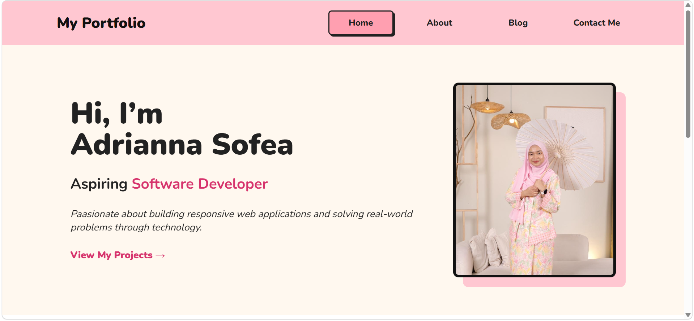
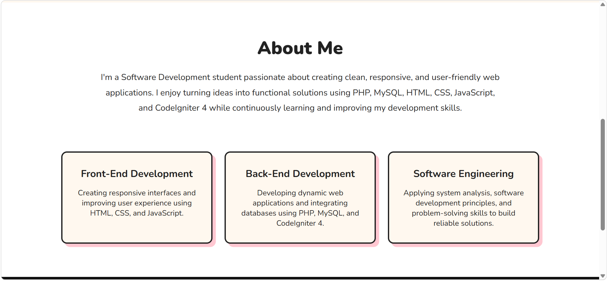
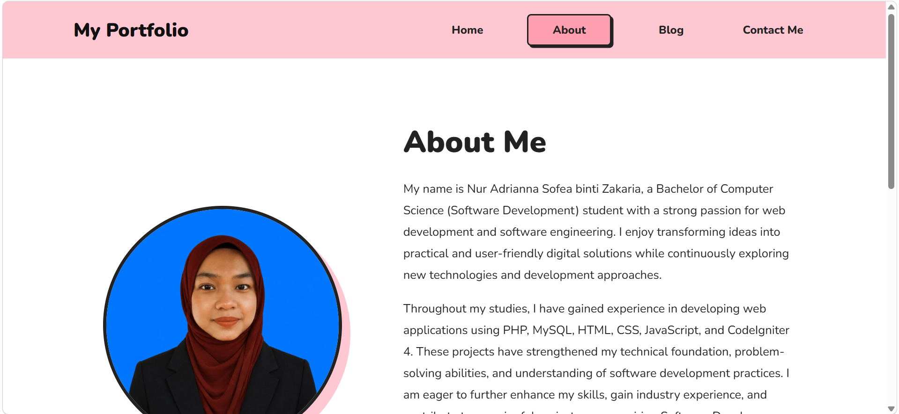
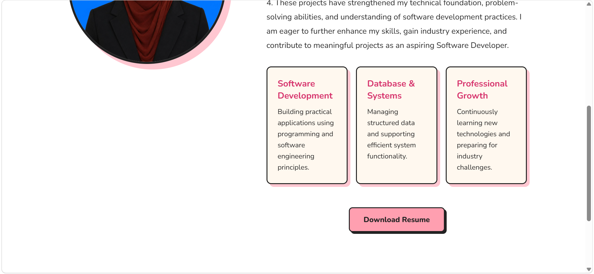
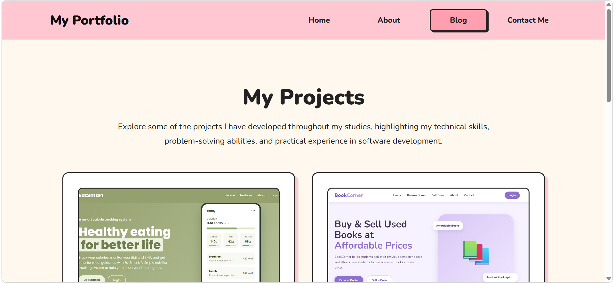
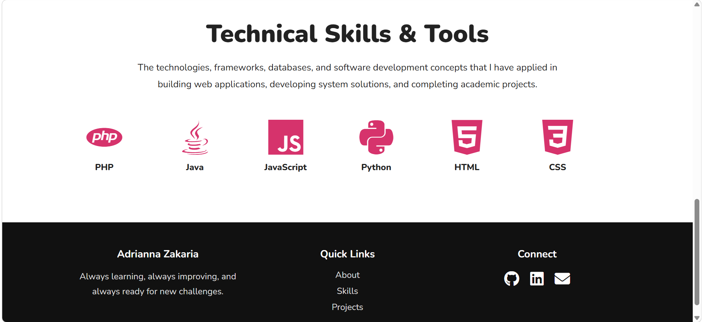
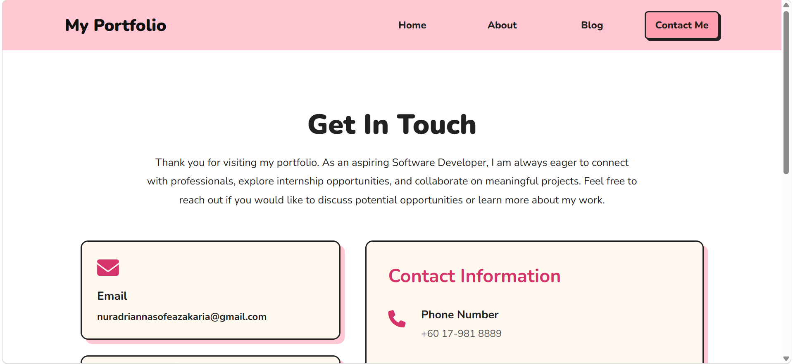
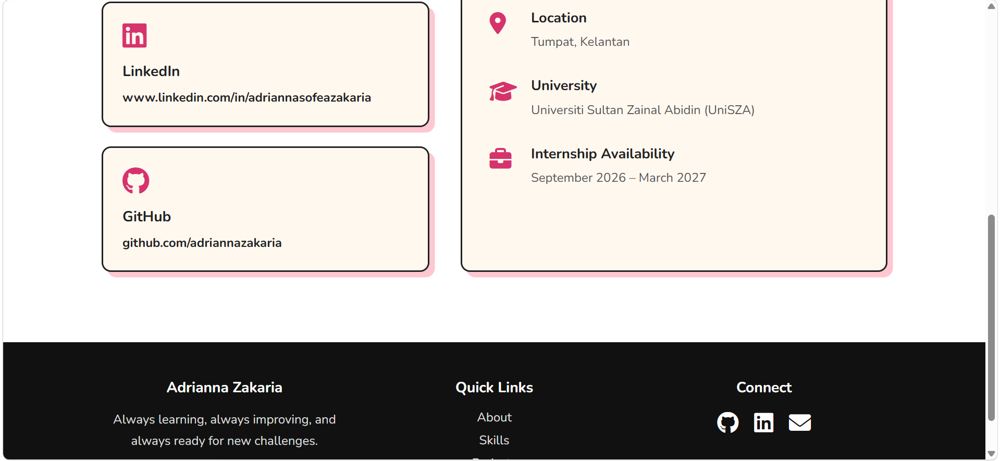

# Personal Portfolio Website

## Overview

This project is a personal portfolio website developed as part of the CSD34203 Special Topics in Software Development course. The website serves as a digital portfolio to showcase my background, technical skills, academic projects, and contact information.

The portfolio was built using HTML, CSS, and JavaScript with a focus on responsive design, user-friendly navigation, and interactive features.

---

## Features

- Responsive Home Page
- About Me Section
- Resume Download Feature
- Project Portfolio Section
- Interactive Project Popup Modal
- Technical Skills & Tools Showcase
- Contact Information Page
- GitHub and LinkedIn Integration
- Responsive Design for Desktop and Mobile Devices

---

## Technologies Used

### Front-End
- HTML5
- CSS3
- JavaScript

### Tools
- Visual Studio Code
- Git
- GitHub

### Technical Skills Demonstrated
- Responsive Web Design
- User Interface Design
- Version Control
- Software Development Principles

---

## Project Pages

### Home Page
Provides a brief introduction, profile image, and navigation to other sections.

### About Page
Displays personal background, educational information, career goals, and resume download functionality.

### Skills & Projects Page
Showcases technical skills, technologies, and academic projects including:
- EatSmart
- BookCorner

### Contact Page
Provides contact information together with GitHub, LinkedIn, and email links.

---

## Screenshots

### Home Page




### About Page




### Blog Page




### Contact Page




---

## How to Run the Project

1. Clone the repository

```bash
git clone https://github.com/adriannazakaria/personal-blog-portfolio.git
```

2. Open the project folder in Visual Studio Code


3. Open `index.html`


4. Run the website using Live Server or open it directly in a web browser


5. Navigate through Home, About, Blog, and Contact pages

---

## Demo Link

- GitHub Repository:

https://github.com/adriannazakaria/personal-blog-portfolio

- Live Website (Github Pages) :

https://adriannazakaria.github.io/personal-blog-portfolio/

---

## Learning Outcomes

Through this project, I gained practical experience in:

- Designing responsive web interfaces
- Building multi-page websites
- Implementing interactive JavaScript features
- Managing project versions using Git and GitHub
- Creating a professional online portfolio

---

## Author

**Nur Adrianna Sofea binti Zakaria**

Bachelor of Computer Science (Software Development) with Honours

Universiti Sultan Zainal Abidin (UniSZA)
